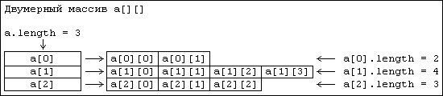

## Теория
### Классы
**Классы** — это, можно сказать, основа основ программирования на Java. Класс — это, по сути, шаблон для объекта. Соответственно каждый объект создан по шаблону своего класса. Шаблон (класс) описывает поля, часто называемые переменными и методы, часто называемые функциями.
* Найти информацию о классах в Java
* Посмотреть видео урок ["Введение в ООП"](https://youtu.be/l_b9K7uQvAI?list=PLsQAG1V_t58AKvV5v4NVXxo68OyLdNX3j)
* Посмотреть видео урок ["Типы данных в Java"](https://youtu.be/JmplWN-FdMQ?list=PLsQAG1V_t58AKvV5v4NVXxo68OyLdNX3j)
* Посмотреть видео урок ["Работа с экземплярами в Java"](https://youtu.be/OMSt9o0Ke-Y?list=PLsQAG1V_t58AKvV5v4NVXxo68OyLdNX3j)
* Посмотреть видео урок ["Пакеты в Java"](https://youtu.be/a6KGNASOtK8?list=PLsQAG1V_t58AKvV5v4NVXxo68OyLdNX3j)

### Методы
**Метод** — это член класса, который содержит в себе инструкции, применяемые к различным объектам. Метод определяется именем и количеством + типом аргументов,  которые необходимо подать ему на вход. Методы могут взаимодействовать с полями класса.

**Статические** (```static```) **методы классов** — это такие методы, к которым можно обратиться, не создавая объект данного класса. И причина в том, что они являются общими для всех объектов одного класса. Методы объявляются в теле класса, после полей класса.
* Найти информацию о методах в Java
* Посмотреть видео урок ["Основы использования методов в классах"](https://youtu.be/2Q4EAl65ePI?list=PLsQAG1V_t58AKvV5v4NVXxo68OyLdNX3j)
* Посмотреть видео урок ["Уровни методов в Java"](https://youtu.be/ttt-Bt_iiYk?list=PLsQAG1V_t58AKvV5v4NVXxo68OyLdNX3j)

### Типы данных
Одной из основных особенностей Java есть то, что данный язык является **строго типизированным**. А это значит, что каждое поле, переменная и константа представляет конкретный тип и этот тип нельзя подменить. Также  тип может быть указан перед именем метода, что предопределяет тип  возвращаемого значения методом.

**Тип** ```int``` служит для представления 32-битных целых чисел со знаком. Диапазон допустимых для этого типа значений — от -2147483648 до 2147483647. Чаще всего этот тип данных используется для хранения обычных целых чисел со значениями, достигающими двух миллиардов.

**Символьный тип** ```char``` предназначен для представления элементов из таблицы символов, например, букв или цифр. Поскольку в Java для представления символов в строках используется кодировка Unicode, разрядность типа char в этом языке — 16 бит. Диапазон типа char — 0..65536.
* Найти информацию о типах данных в Java
* Посмотреть видео урок ["Типы данных в Java"](https://youtu.be/JmplWN-FdMQ?list=PLsQAG1V_t58AKvV5v4NVXxo68OyLdNX3j)
* Узнать отличия между примитивами и ссылочными типами

### Условный оператор IF
Иногда нам нужно выполнить различные действия в зависимости от условий. Оператор ```if``` является основным оператором выбора в Java и позволяет выборочно изменять ход выполнения программы и это одно из основных отличий между программированием и простым вычислением.
* Найти информацию об условном операторе ```if``` в Java
* Посмотреть видео урок ["Условный оператор IF в Java"](https://youtu.be/pMFj13L9b5c?list=PLsQAG1V_t58AKvV5v4NVXxo68OyLdNX3j)
* Ознакомиться с тернарным оператором

### Массивы
**Массив** — это структура данных, в которой хранятся элементы одного типа. Его можно представить, как набор пронумерованных ячеек, в каждую из которых можно поместить какие-то данные. Доступ к конкретной ячейке осуществляется через ее номер. Номер элемента в массиве также называют индексом. 

В Java **массивы однородны**, то есть во всех ячейках хранятся элементы одного типа. Так, массив целых чисел содержит только целые числа, массив строк — только строки и т.д. Массив может содержать в себе подмассивы, поскольку массив это тоже объект (многомерные массивы) ;)



* Найти информацию о массивах в Java
* Посмотреть видео урок ["Массивы в Java"](https://youtu.be/VFAETKdzB44?list=PLsQAG1V_t58AKvV5v4NVXxo68OyLdNX3j)

### Цикл FOR
**Циклы** являются такой же важной частью программирования, как условные операторы. С помощью циклов можно организовать повторение выполнения участков кода. Циклы, как правило, используются для прохода по одномерным и многомерным массивам и структурам данных для нахождения определенных элементов и дальнейших операций с ними. 
* Найти информацию о цикле ```for``` в Java
* Посмотреть видео урок ["Циклы в Java"](https://youtu.be/YiW_FKKEKy0?list=PLsQAG1V_t58AKvV5v4NVXxo68OyLdNX3j)
* Найдите примеры применения оператора ```break```
* Найдите примеры применения оператора ```continue```

### Локальные переменные
**Переменная** — это область памяти, к которой мы обращаемся за находящимися там данными, используя имя переменной. При этом у этой помеченной именем области есть еще и адрес, выраженный числом и понятный компьютерной системе. Сам этот адрес, в свою очередь, также можно записать в особую переменную. Переменную, содержащую адрес области памяти, называют указателем. 

**Область видимости переменной** — это часть программы, в которой на переменную можно сослаться. Переменная видна только в рамках блока кода в котором она объявлена. Аргументы метода, например, видны только в рамках тела метода, как и любые другие переменные, что объявлены внутри метода.
* Найдите отличия между полями класса и локальными переменными
* Разберитесь в областях видимости для:
	* полей классов
	* переменных метода
	* переменных цикла
	* переменных условного оператора ```if``` 

### Оператор return
Методы могут возвращать некоторое значение. В языке Java для выполнения явного возврата из метода используется оператор ```return```. То есть он снова передает управление объекту, который вызвал данный метод. 

Если метод возвращает значение ```void```, то оператор ```return``` не является необходимым. Если метод возвращает значение, оператор ```return``` сопровождается некоторым выражением. Значение этого выражения становится возвращаемым значением метода. 
* Найдите описание ```return``` в документации Oracle
* Поэкспериментируйте с ```return```, пропишите его в разных участках метода, в разных блоках кода

### Max и Min значения Integer
**Класс** ```Integer``` является классом-оберткой примитивного типа данных ```int```.  Будучи классом-оберткой, ```Integer``` предоставляет различные константы и методы для работы с целыми числами. 
Чтобы найти максимальное и минимальное значения ```Integer```, можно обратится к двум его полям. Максимальное значение объекта ```Integer``` (2147483647) может быть найдено с помощью вызова ```Integer.MAX_VALUE```, а минимальное значение ```Integer``` (-2147483648) — через обращение к ```Integer.MIN_VALUE```.
* Найдите информацию о классах-обертках для примитивов

## Практическая работа
Нельзя использовать готовые реализации из библиотек Java. Примените циклы, условные операторы или стримы. Создавайте локальные переменные, если нужно. После завершения работы обновите ваш гит репозиторий. 

Все классы этого задания должны быть в пакете:
```java
package com.kovalevskyi.academy.codingbootcamp.week0.day4
```
### Класс Alphabet
**Внимание!** Реализация этого класса должна быть без хардкода, только при помощи циклов.

#### generateAlphabet  
Написать метод **generateAlphabet()**, который возвращает массив символов — алфавит (нижний регистр), начиная с 'a' заканчивая 'z' (ascending order). 
```java
// сигнатура метода
public static char[] generateAlphabet(){
     // TO DO
}
```

#### generateReversedAlphabet
Написать метод  **generateReversedAlphabet()**, который возвращает массив символов — алфавит (нижний регистр), начиная с 'z' заканчивая 'a' (descending order). 
```java
// сигнатура метода
public static char[] generateReversedAlphabet(){
     // TO DO
}
```

### Класс Numbers1
Ознакомьтесь полностью со списком методов и ограничениями в их реализации. Приступайте к реализации. 

*Нельзя использовать готовые реализации из библиотек Java.* Например, нельзя использовать: ```String.valueOf```, ```String.format```, множество ```Set```, ```Map```, класс ```Math``` и черную магию. Используйте только циклы, условные операторы или стримы. Создавайте локальные переменные, если нужно. Переиспользуйте собственный код!

**Внимание!** Реализация должна быть без хардкода, т.е. без ручного перечисления всех чисел и т.п.

Тесты будут проверять этот метод на разные пограничные значения. Обсудите с группой какие в этом методе должны быть пограничные значения, посмотрите на то, что именно ожидает от вас тест. Как только поняли, что именно от вас ожидает тест, не забудьте поделится этим знанием с группой.

#### generateNumbers
Написать метод **generateNumbers()**, который возвращает массив чисел от 0 до 99  (ascending order).
```java
// сигнатура метода
public static int[] generateNumbers(){
     // TO DO
}
```

#### findBiggest (int left, int right)
Этот метод принимает на вход два целых числа и возвращает  большее из них.
```java
// сигнатура метода
public static int findBiggest(int left, int right){
     // TO DO
}
```

#### findBiggest (int left, int mid, int right)
Этот метод принимает на вход три целых числа и возвращает большее из них.
```java
// сигнатура метода
public static int findBiggest(int left, int mid, int right){
     // TO DO
}
```

#### findBiggest (int[] numbers)
Этот метод принимает на вход массив целых чисел, а вернуть должен самое большое число в этом массиве.
```java
// сигнатура метода
public static int findBiggest(int[] numbers){
     // TO DO
}
```

#### findIndexOfBiggestNumber
В этом методе реализуйте логику, которая находит индекс самого большого числа в массиве.
```java
// сигнатура метода
public static int findIndexOfBiggestNumber(int[] numbers){
     // TO DO
}
```

#### isNegative
Этот метод принимает на вход целое число и отвечает на вопрос: “Оно отрицательное?”.
```java
// сигнатура метода
public static boolean isNegative(int number){
     // TO DO
}
```

#### convertToCharArray
Этот метод принимает на вход целое число, а возвращает массив символов, из которых состоит это число. Число может оказаться отрицательным.
```java
// сигнатура метода
public static char[] convertToCharArray(int number){
     // TO DO
}
```
Не забудьте предусмотреть работу метода с ```Integer.MAX_VALUE``` и ```Integer.MIN_VALUE```.
