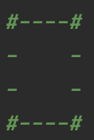
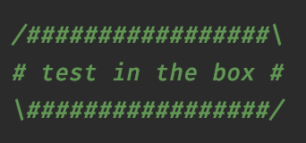
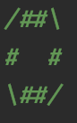
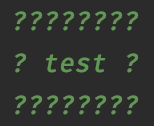

## Практическая работа

### Задание: Box Generator
В данном задании мы реализуем простую программу, которая рисует прямоугольник в соответствии с заданными параметрами. Пример прямоугольника:



Программа принимает на вход 4 аргумента:
* Ширина
* Длина
* Символ, который должен быть использован в качестве стороны
* Символ, который должен быть использован в качестве уголка

Соответственно, чтобы получить ровно такой же прямоугольник как на картинке, нужно передать следующее входные аргументы: 6 4 - #

Если количество аргументов не равно 4, то программа должна вывести: **Please provide 4 arguments, current amount: %d**  
где %d — текущее количество аргументов, переданное программе. 

Например, если было передано: “2 3”, то программа напишет: *Please provide 4 arguments, current amount: 2*

В случае, если какой-либо входной аргумент имеет неверную длину или тип, программа должна кинуть ```IllegalArgumentException```.
```java
package com.kovalevskyi.academy.codingbootcamp.week2.day1;

public class BoxGenerator {

  public static void main(String[] args) {
    // TODO
  }
}
```

### Задание: TextPrinter
В данном задании мы реализуем программу, которая выводит текст, переданный во входном аргументе, в рамочке вот так:



Если в качестве аргумента пришла пустая строка, то рамочка выглядит вот так:



Если на вход не было передано правильное число аргументов, то программа должна вывести: **Please provide only one input argument, current amount: %d**  
где %d — текущее количество аргументов, переданное программе.

```java
package com.kovalevskyi.academy.codingbootcamp.week2.day1;

public class TextPrinter {

  public static void main(String[] args) {
    // TODO
  }
}
```

### Задание: TextPrinter2
Новая программа полностью повторяет предыдущую с той лишь разницей, что она на вход принимает два аргумента:
* Символ, который нужно использовать для рамочки
* Текст

Например, если на вход передать "?", "test", то программа выведет:



```java
package com.kovalevskyi.academy.codingbootcamp.week2.day1;

public class TextPrinter2 {

  public static void main(String[] args) {
    // TODO
  }
}
```
