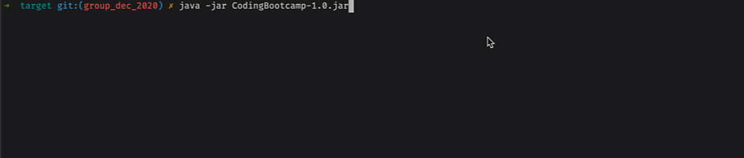

## Практическая работа

### Progress Bar
Задача написать программу, которая выводит на экран progressbar. Вот так будет выглядеть конечная версия:

На вход программа получает не менее двух аргументов, каждый из которых положительное целое число. Программа рисует progressbar.

Progressbar имеет столько элементов, сколько указано в первом передаваемом аргументе (в примере 15 элементов в первый раз, 3 во второй и 15 в третий)

Все остальные аргументы — это число, определяющее количество секунд, которое прогресс бар должен ждать на каждый элемент. Если число всего одно, то ровно это количество секунд и будет тратиться, если более одного, то будет выбрано случайным образом. 

Т.е. в примере можно увидеть, что в первом случае было передано "15 1", то есть прогресс из 15 элементов и каждый занимает 1 секунду. В втором примере "3 2", то есть 3 элемента по 2 секунды. В самом конце "15 1 1 1 5 7 1", то есть 15 элементов, при этом на каждом элементе будет выбрано случайным образом число задержки в секундах из "1 1 1 5 7 1". Как можно увидеть в последнем примере, чаще всего задержка равна одной секунде, это потому что 1 встречается четыре раза.

Если передано неверное число аргументов (или неверного типа), нужно вывести сообщение об ошибке с подсказкой о том, сколько аргументов нужно вывести.

**[Опционально]** Если интересно, можно сделать с использованием сторонней библиотеки: [picocli](https://picocli.info)

Вам также дан jar файл, с которым можете поиграться и посмотреть как программа должна выглядеть в конечном варианте.

В данном задание рекомендуется установить JDK и любимый IDE (vim или IDEA или что угодно другое) на локальной машине (И не использовать штатный контейнер который мы предоставили). Эта важно чтобы был опыт установки и настройки окружающей среды полноценно с JDK до IDE (в Docker Image много чего уже настроено).
