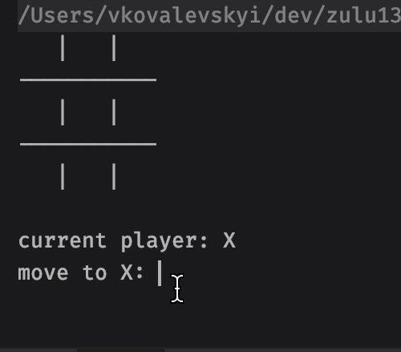

## Практическая работа

### Tic-Tac-Toe (Крестики-нолики)
Последний проект(💥) еще более свободный. Задача — написать простую игру «Крестики-нолики» с интерфейсом в консоли. Пример того как, игра может выглядеть:

Вами должно быть реализовано минимум 3 класса.

При запуске на вход программа не получает никаких аргументов. Вы можете использовать любые библиотеки как ваши собственные, так и внешние.

Перед выполнением рекомендуем ознакомиться с паттернами проектирования [GRASP](https://ru.wikipedia.org/wiki/GRASP).
